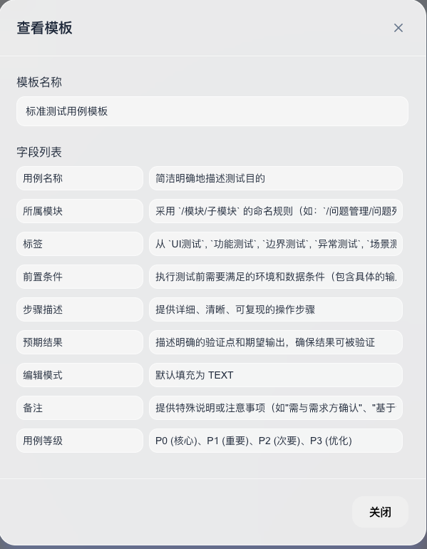
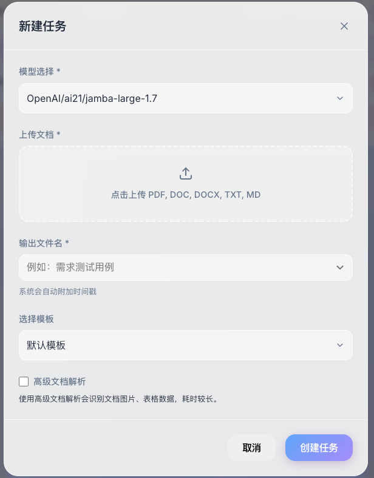
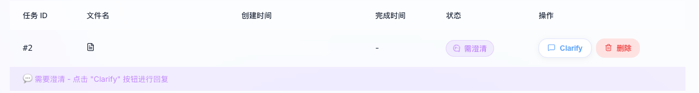
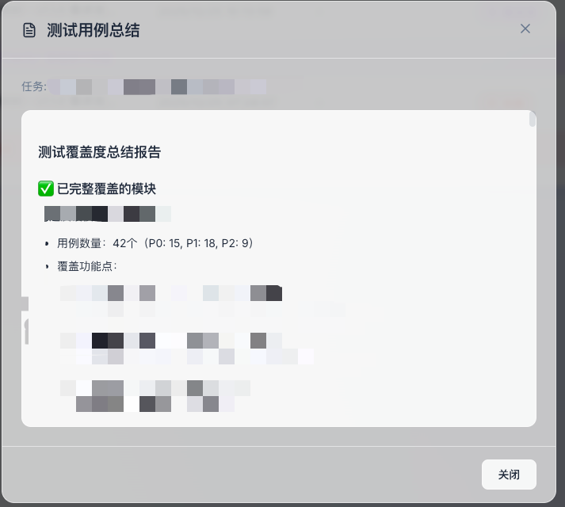

# Flow Test Engine

基于 LangGraph + Docling 的智能测试用例生成引擎，支持从需求文档自动生成测试用例。

## ✨ 特性

- 🤖 **AI 驱动**：基于 LangGraph 工作流，智能解析需求文档
- 📄 **多格式支持**：支持 PDF、DOCX、TXT、MD 等多种文档格式
- 🔄 **人机协作**：支持澄清问题的交互式工作流
- 🎨 **现代化界面**：基于 React + TypeScript 的响应式 Web 界面
- 📊 **Excel 导出**：自动生成结构化的测试用例 Excel 文档
- 💾 **轻量存储**：使用 SQLite 数据库，无需额外安装

## 功能介绍

### 多家 LLM 供应商支持
OpenAI 厂商支持符合 OpenAI API 规范的模型接入。

### 用例输出模板自定义
支持自定义测试用例生成模板，满足不同测试管理平台的用例导入要求。

### 文档解析
提供了轻量级和精细的文档解析模式，满足不同需求。
- 开启高级解析模式可以提取图片和表格，适合复杂文档。
- 关闭高级解析模式则快速提取文本，适合简单文档。

### Human-in-the-Loop 澄清交互
在生成测试用例过程中，如遇到不明确的需求，系统会暂停并提示

### AIGC 总结


## 🛠 技术栈

### 后端
- **语言**：Python 3.13+
- **框架**：FastAPI
- **AI 工作流**：LangGraph + LangChain
- **文档解析**：Docling
- **数据库**：SQLite
- **包管理**：uv

### 前端
- **框架**：React 19 + TypeScript
- **构建工具**：Vite
- **UI 组件**：自定义组件库
- **动画**：Framer Motion
- **HTTP 客户端**：Axios

## 📁 项目结构

```
flow_test_engine/
├── backend/                    # Python 后端
│   ├── app/
│   │   ├── api/               # API 路由
│   │   ├── core/              # 核心模块（配置、数据库、安全）
│   │   ├── models/            # 数据模型
│   │   ├── schemas/           # Pydantic Schema
│   │   ├── services/          # 业务服务
│   │   │   ├── document_parser.py   # Docling 文档解析
│   │   │   ├── case_generator.py    # LangGraph 工作流
│   │   │   └── result_extractor.py  # 结果提取
│   │   └── main.py            # FastAPI 入口
│   ├── config/
│   │   └── prompt.md          # AI 提示词模板
│   ├── data/                  # SQLite 数据库
│   ├── uploads/               # 上传文件
│   ├── outputs/               # 输出文件
│   ├── .env.example           # 环境变量示例
│   └── pyproject.toml         # Python 依赖配置
├── frontend/                   # 前端项目
│   ├── src/
│   │   ├── components/        # React 组件
│   │   ├── services/          # API 服务
│   │   └── App.tsx            # 主应用
│   └── package.json
├── Dockerfile                  # Docker 镜像构建
└── docker-compose.yml          # Docker Compose 配置
```

## 🚀 快速开始

### 方式一：Docker 部署（推荐）

#### 环境要求

- Docker 20.10+
- Docker Compose 2.0+

#### 快速启动

1. **创建部署目录并下载配置文件**

```bash
# 下载 docker-compose.yml
curl -O https://raw.githubusercontent.com/linlee996/flow_test_engine/main/docker-compose.yml
```

2. **启动服务**

```bash
# 拉取镜像并启动
docker-compose up -d

# 查看日志
docker-compose logs -f

# 停止服务
docker-compose down
```

3. **访问应用**

打开浏览器访问 `http://localhost:8080`
默认管理员账密：admin/admin

> **注意**：镜像托管在 GitHub Container Registry (ghcr.io)，首次拉取可能需要一些时间

### 方式二：本地开发部署

#### 环境要求

- Python 3.13+
- Node.js 20+
- uv (Python 包管理器)

#### 启动后端

```bash
cd backend

# 安装 uv（如果未安装）
curl -LsSf https://astral.sh/uv/install.sh | sh

# 安装依赖
uv sync

# 配置环境变量
cp .env.example .env
# 编辑 .env 文件

# 启动服务
uv run uvicorn app.main:app --reload --host 0.0.0.0 --port 8080
```

后端服务将在 `http://localhost:8080` 启动

#### 启动前端

```bash
cd frontend

# 安装依赖
npm install

# 开发模式
npm run dev

# 生产构建
npm run build
```

前端开发服务器将在 `http://localhost:5173` 启动

## 📖 API 文档

### 基础信息

- **Base URL**: `http://localhost:8080`
- **API 前缀**: `/api/v1`
- **响应格式**: JSON

### 认证接口

#### 注册

```http
POST /api/v1/auth/register
Content-Type: application/json

{
  "username": "user",
  "email": "user@example.com",
  "password": "password123"
}
```

#### 登录

```http
POST /api/v1/auth/login
Content-Type: application/x-www-form-urlencoded

username=user&password=password123
```

### 任务接口

#### 上传文件

```http
POST /api/v1/upload
Content-Type: multipart/form-data

file: <文件>
```

#### 创建任务

```http
POST /api/v1/task/create
Content-Type: application/json
Authorization: Bearer <token>

{
  "file_path": "uploads/xxx.pdf",
  "template_id": 1,  // 可选
  "llm_config_id": 1  // 可选
}
```

#### 提交澄清

```http
POST /api/v1/task/{task_id}/clarify
Content-Type: application/json
Authorization: Bearer <token>

{
  "clarification": "用户的澄清回答"
}
```

#### 获取任务列表

```http
GET /api/v1/tasks?skip=0&limit=20
Authorization: Bearer <token>
```

#### 获取任务总结

```http
GET /api/v1/task/{task_id}/summary
Authorization: Bearer <token>
```

#### 下载 Excel

```http
GET /api/v1/download/{task_id}
Authorization: Bearer <token>
```

#### 删除任务

```http
DELETE /api/v1/tasks/{task_id}
Authorization: Bearer <token>
```

### 模板接口

#### 获取模板列表

```http
GET /api/v1/templates
Authorization: Bearer <token>
```

#### 创建模板

```http
POST /api/v1/templates
Content-Type: application/json
Authorization: Bearer <token>

{
  "name": "模板名称",
  "content": "模板内容"
}
```

## 🔄 工作流说明

1. **文档上传** → Docling 解析为 Markdown + 提取图片/表格
2. **需求分析** → LLM 分析是否有待澄清问题
3. **人机澄清** → 如有问题，等待用户输入（interrupt）
4. **用例生成** → LLM 生成测试用例
5. **结果提取** → 从 Markdown 提取表格转 Excel + 总结保存 MD

## 🎯 使用流程

1. **注册/登录**：创建账号并登录系统
2. **上传需求文档**：支持 PDF、DOCX、TXT、MD 格式
3. **创建任务**：选择模板和 LLM 配置（可选）
4. **等待处理**：系统自动解析文档并生成测试用例
5. **澄清问题**：如有待澄清问题，系统会暂停等待用户输入
6. **查看结果**：查看生成的测试用例总结
7. **下载 Excel**：下载结构化的测试用例文档

## 🔧 配置说明

### 环境变量

在 `backend/.env` 中配置：

| 变量名 | 说明 | 示例 |
|--------|------|------|
| `DATABASE_URL` | 数据库连接 | `sqlite+aiosqlite:///./data/flow_test.db` |
| `SECRET_KEY` | JWT 密钥 | `your-secret-key` |

### 修改 AI 提示词

编辑 `backend/config/prompt.md` 文件可以自定义测试用例生成逻辑。

> **重要提示**：修改提示词时，**必须保持输出格式部分不变**，否则会影响测试用例的解析。

## 🐛 常见问题

### Q: Docker 容器启动失败？

**A**: 检查以下几点：
1. Docker 和 Docker Compose 版本是否满足要求
2. 端口 8080 是否被占用：`lsof -i :8080`
3. 查看容器日志：`docker-compose logs -f`

### Q: 文档解析失败？

**A**: 可能原因：
1. 文档格式不支持或损坏
2. 文档内容过于复杂
3. 查看后端日志了解详细错误信息

### Q: 如何查看日志？

**Docker 部署**：
```bash
docker-compose logs -f
```

**本地开发**：
```bash
# 后端日志会输出到终端
cd backend
uv run uvicorn app.main:app --reload
```

### Q: 如何清理数据？

```bash
# 删除数据库文件
rm backend/data/flow_test.db

# 清理上传和输出文件
rm -rf backend/uploads/* backend/outputs/*
```

## 🤝 贡献

欢迎提交 Issue 和 Pull Request！

## 📄 许可证

MIT License

## 📧 联系方式

如有问题或建议，请通过以下方式联系：

- 提交 Issue
- 发送邮件至项目维护者

---
